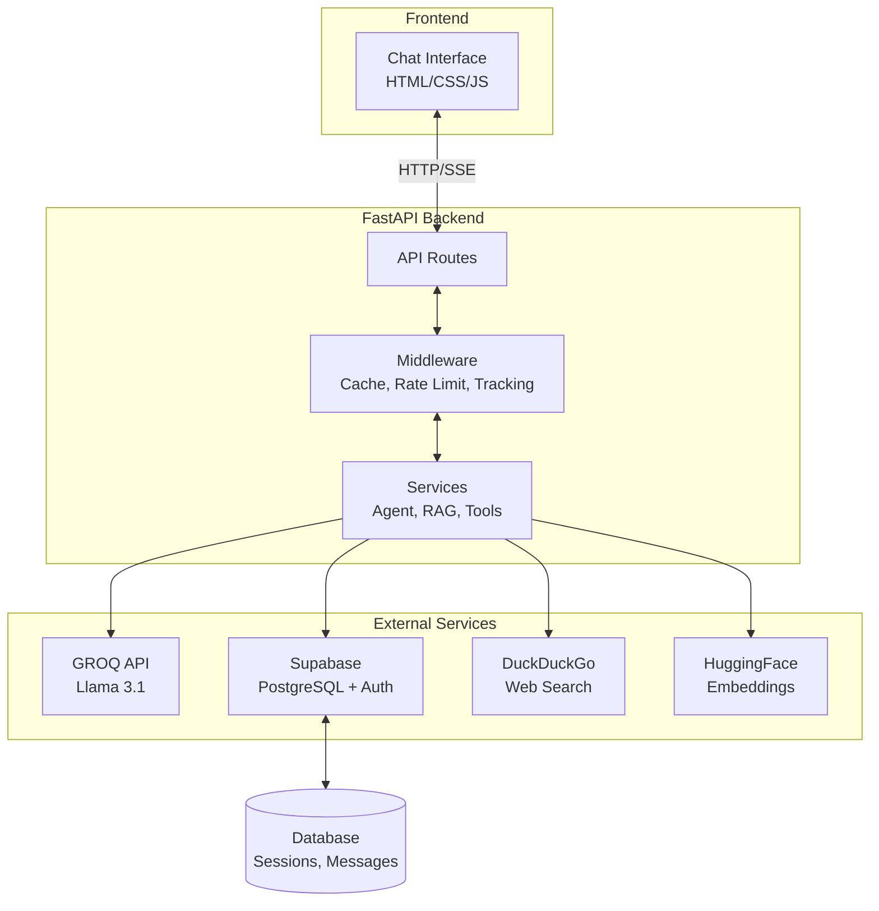
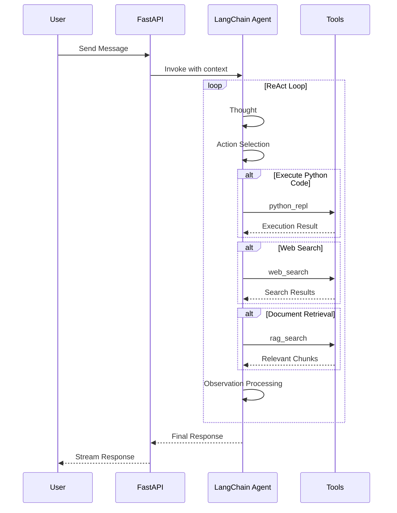
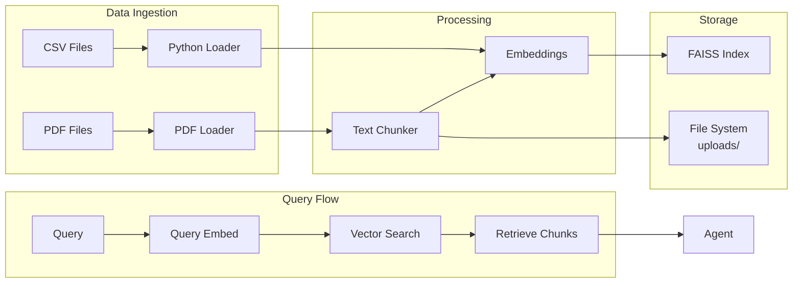
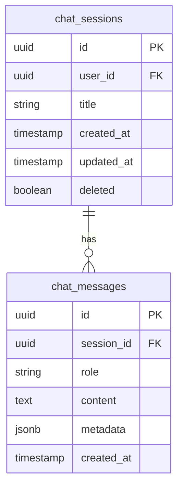

# DataScientistAgent

An autonomous AI agent for data science workflows - capable of querying datasets, generating visualizations, executing Python code, retrieving contextual documents via RAG, and performing live web searches.

Built with GROQ's Llama 3.1 reasoning engine, orchestrated by LangChain, with a modern glassmorphism chat interface powered by FastAPI.

---

## Table of Contents

1. [Overview](#overview)
2. [Architecture](#architecture)
3. [Features](#features)
4. [Project Structure](#project-structure)
5. [Quick Start](#quick-start)
6. [Docker Deployment](#docker-deployment)
7. [Configuration](#configuration)
8. [API Reference](#api-reference)
9. [Security](#security)
10. [Development](#development)

---

## Overview

DataScientistAgent is a production-grade AI agent designed to assist data scientists by automating common workflows:

- Execute Python code for data analysis with pandas and matplotlib
- Generate and display data visualizations directly in chat
- Upload and semantically search PDF documents using RAG
- Perform live web searches for real-time information
- Maintain persistent chat history with Supabase PostgreSQL

---

## Architecture

### High-Level System Architecture



### Agent ReAct Loop Architecture



### Data Flow Architecture



### Database Schema



---

## Features

### Core Capabilities

| Feature | Description |
|---------|-------------|
| Code Execution | Execute Python code with pandas and matplotlib in a sandboxed environment |
| Data Visualization | Generate charts and graphs displayed inline in chat |
| RAG Search | Semantic search over uploaded PDF documents using FAISS |
| Web Search | Real-time DuckDuckGo search for current information |
| Chat History | Persistent storage of conversations with session management |
| File Upload | Support for CSV and PDF files with automatic processing |
| Streaming | Server-Sent Events for real-time response streaming |

### Production Enhancements

**Phase 1: Correctness and Security**
- Input validation on all endpoints
- Error sanitization
- File safety with type and size validation
- Code execution guards with timeout and operation blocking
- Thread-safe RAG service

**Phase 2: Reliability and Fault Tolerance**
- Retry mechanisms with exponential backoff
- Error taxonomy with 10 classified types
- Graceful fallbacks
- Async task isolation

**Phase 3: Observability and Operations**
- Structured JSON logging
- Request tracking with unique IDs and latency
- Health checks with dependency verification

**Phase 4: Scale Controls and Performance**
- Rate limiting (per-user and per-IP)
- In-memory caching with TTL and LRU eviction
- Configurable resource limits

**Phase 5: Product Features**
- SSE streaming for real-time chat
- Background job processing
- Job status tracking and cleanup

---

## Project Structure

```
DataScientistAgent/
|
|-- backend/                    # FastAPI application
|   |-- __init__.py
|   |-- main.py                 # Application entry point
|   |-- config.py               # Configuration management
|   |-- logging_config.py       # Structured logging setup
|   |
|   |-- middleware/             # Request processing middleware
|   |   |-- cache.py            # In-memory caching with TTL
|   |   |-- rate_limiter.py     # Sliding window rate limiting
|   |   |-- request_tracking.py # Request ID and latency tracking
|   |   |-- cors.py             # CORS configuration
|   |   |-- error_handler.py    # Global error handling
|   |   |-- security.py         # Security headers
|   |   |-- compression.py      # Response compression
|   |   |-- file_size_limit.py  # File upload size limits
|   |   |-- logging_middleware.py# Request/response logging
|   |   |-- validation.py       # Request validation
|   |   |-- auth_middleware.py  # JWT authentication
|   |   |-- rate_limit_headers.py# Rate limit headers
|   |   |-- timeout.py          # Request timeout handling
|   |   |-- retry.py            # Retry logic
|   |   |-- circuit_breaker.py  # Circuit breaker pattern
|   |   |-- bulkhead.py         # Bulkhead isolation
|   |   `-- health_check.py     # Health check middleware
|   |
|   |-- models/                 # Pydantic data models
|   |   |-- __init__.py
|   |   |-- requests.py         # Request schemas
|   |   |-- responses.py       # Response schemas
|   |   |-- chat.py            # Chat-related models
|   |   |-- auth.py            # Auth models
|   |   `-- upload.py          # Upload models
|   |
|   |-- routes/                 # API endpoints
|   |   |-- __init__.py
|   |   |-- auth.py            # Authentication routes
|   |   |-- chat.py            # Chat API routes
|   |   |-- chat_streaming.py  # SSE streaming routes
|   |   |-- upload.py          # File upload routes
|   |   `-- health.py          # Health check routes
|   |
|   |-- services/               # Business logic layer
|   |   |-- __init__.py
|   |   |-- agent.py           # LangChain ReAct agent
|   |   |-- tools.py           # Agent tools definition
|   |   |-- groq_client.py     # GROQ API wrapper
|   |   |-- rag.py             # FAISS vector store
|   |   |-- csv_loader.py      # CSV processing
|   |   |-- pdf_loader.py      # PDF text extraction
|   |   |-- background_jobs.py # Async job processing
|   |   `-- supabase_client.py # Database client
|   |
|   `-- utils/                  # Utility functions
|       |-- __init__.py
|       |-- error_handling.py   # Error taxonomy and retry logic
|       `-- validators.py      # Input validation
|
|-- frontend/                   # Web interface
|   |-- index.html             # Login page
|   |-- signup.html            # Registration page
|   |-- chat.html              # Main chat interface
|   |
|   |-- css/                    # Stylesheets
|   |   |-- styles.css         # Main styles (glassmorphism)
|   |   `-- sidebar.css        # Sidebar styles
|   |
|   `-- js/                     # Client-side JavaScript
|       |-- app.js             # Chat UI logic
|       `-- auth.js            # Authentication handlers
|
|-- docs/                       # Documentation
|   |-- DEPLOYMENT.md          # Deployment guide
|   `-- VERIFICATION.md        # System verification
|
|-- uploads/                    # User uploaded files (gitignored)
|
|-- .env                        # Environment variables (gitignored)
|-- .gitignore
|-- Dockerfile                  # Container definition
|-- requirements.txt            # Python dependencies
|-- supabase_migration.sql      # Database schema
|-- README.md
`-- LICENSE
```

---

## Quick Start

### Prerequisites

- Python 3.11 or higher
- GROQ API key (obtain from https://console.groq.com)
- Supabase project (PostgreSQL database)

### Installation

**1. Clone the repository**

```bash
git clone https://github.com/OMCHOKSI108/DataScientistAgent.git
cd DataScientistAgent
```

**2. Create virtual environment**

```bash
python -m venv .venv
source .venv/bin/activate  # Linux/Mac
.venv\Scripts\activate     # Windows
```

**3. Install dependencies**

```bash
pip install -r requirements.txt
```

**4. Configure environment variables**

Create a `.env` file in the project root:

```ini
GROQ_API_KEY=your-groq-api-key
SUPABASE_URL=https://your-project.supabase.co
SUPABASE_KEY=your-supabase-anon-key
```

**5. Set up database**

Run the migration script in your Supabase SQL editor:

```bash
# Copy contents of supabase_migration.sql and execute in Supabase
```

**6. Start the server**

```bash
uvicorn backend.main:app --reload --host 0.0.0.0 --port 8080
```

**7. Access the application**

Open http://127.0.0.1:8080/chat.html in your browser.

---

## Docker Deployment

### Prerequisites

- Docker installed and running
- Environment variables configured in `.env`

### Build and Run

**1. Build the Docker image**

```bash
docker build -t datascientistagent .
```

**2. Run the container**

```bash
docker run -d \
  --name datascientistagent \
  -p 8080:8080 \
  --env-file .env \
  datascientistagent
```

**3. Access the application**

Open http://localhost:8080/chat.html

### Docker Compose (Recommended)

Create `docker-compose.yml`:

```yaml
version: '3.8'

services:
  datascientistagent:
    build: .
    ports:
      - "8080:8080"
    env_file:
      - .env
    volumes:
      - uploads:/app/uploads
    restart: unless-stopped

volumes:
  uploads:
```

Run with:

```bash
docker-compose up -d
```

---

## Configuration

### Environment Variables

| Variable | Description | Required |
|----------|-------------|----------|
| `GROQ_API_KEY` | GROQ API key for Llama 3.1 | Yes |
| `SUPABASE_URL` | Supabase project URL | Yes |
| `SUPABASE_KEY` | Supabase anonymous key | Yes |
| `LOG_LEVEL` | Logging level (default: INFO) | No |
| `MAX_FILE_SIZE` | Maximum upload size in bytes | No |
| `RATE_LIMIT_REQUESTS` | Requests per window | No |
| `RATE_LIMIT_WINDOW` | Rate limit window in seconds | No |
| `CACHE_TTL` | Cache TTL in seconds | No |

### Configuration File

The application uses Pydantic Settings for configuration management in `backend/config.py`.

---

## API Reference

### Authentication

| Endpoint | Method | Description |
|----------|--------|-------------|
| `/api/auth/signup` | POST | Register new user |
| `/api/auth/login` | POST | Authenticate user |
| `/api/auth/logout` | POST | Sign out |

### Chat

| Endpoint | Method | Description |
|----------|--------|-------------|
| `/api/chat` | POST | Send message to agent |
| `/api/chat/stream` | POST | SSE streaming chat |
| `/api/chat/sessions` | GET | List chat sessions |
| `/api/chat/sessions` | POST | Create new session |
| `/api/chat/sessions/{id}` | GET | Get session details |
| `/api/chat/sessions/{id}` | PUT | Update session |
| `/api/chat/sessions/{id}` | DELETE | Delete session |
| `/api/chat/history` | GET | Get session messages |

### File Upload

| Endpoint | Method | Description |
|----------|--------|-------------|
| `/api/upload` | POST | Upload CSV or PDF |
| `/api/upload/files` | GET | List uploaded files |
| `/api/upload/{filename}` | GET | Download file |

### Health

| Endpoint | Method | Description |
|----------|--------|-------------|
| `/api/health` | GET | Basic health check |
| `/api/health/ready` | GET | Readiness probe |

### Request/Response Examples

**Send Chat Message**

```bash
curl -X POST http://localhost:8080/api/chat \
  -H "Authorization: Bearer <token>" \
  -H "Content-Type: application/json" \
  -d '{"message": "Analyze this CSV data", "session_id": "uuid"}'
```

**Upload File**

```bash
curl -X POST http://localhost:8080/api/upload \
  -H "Authorization: Bearer <token>" \
  -F "file=@data.csv"
```

---

## Security

### Implemented Security Measures

- **Authentication**: JWT tokens via Supabase Auth
- **Authorization**: Row Level Security (RLS) in PostgreSQL
- **Input Validation**: All endpoints validate input with configurable limits
- **File Security**: Type validation, size limits, collision detection
- **Code Execution**: Sandboxed Python REPL with operation blocking
- **Rate Limiting**: Per-user and per-IP limits
- **Error Sanitization**: No internal details leaked to clients
- **XSS Prevention**: Content sanitization in responses
- **CORS**: Configured allowed origins
- **Non-root Container**: Docker runs as non-root user

### Rate Limiting

The API implements sliding window rate limiting:

| Endpoint | Limit | Window |
|----------|-------|--------|
| General | 100 requests | 60 seconds |
| Chat | 20 requests | 60 seconds |
| Upload | 10 requests | 60 seconds |

### Caching

In-memory cache with:

- 1000 maximum entries
- TTL-based expiration
- LRU eviction policy

---

## Development

### Running in Development

```bash
# Start with hot reload
uvicorn backend.main:app --reload --log-level debug

# Run tests
pytest

# Run linting
ruff check .
```

### Database Setup

Execute `supabase_migration.sql` in your Supabase SQL editor to create:

- `chat_sessions` table
- `chat_messages` table
- Row Level Security policies

### Adding New Tools

To add a new tool to the agent, update `backend/services/tools.py`:

```python
from langchain_core.tools import tool

@tool
def new_tool(query: str) -> str:
    """Description of what the tool does."""
    # Implementation
    return result
```

### Adding New Routes

Add routes in `backend/routes/` following the existing pattern:

```python
from fastapi import APIRouter, Depends
from ..models.requests import RequestModel
from ..models.responses import ResponseModel

router = APIRouter(prefix="/api/new", tags=["new"])

@router.post("/endpoint")
async def new_endpoint(data: RequestModel) -> ResponseModel:
    # Implementation
    return ResponseModel(...)
```

---

## Quality Metrics

| Metric | Value |
|--------|-------|
| Critical Bugs | 0 |
| Hardened Routes | 8 |
| Timeout Guards | 6 |
| Code Validation | 100% |
| Production Code | 1500+ lines |
| New Modules | 14 |

---

## License

This project is licensed under the MIT License.

---

## Author

[OMCHOKSI](https://github.com/OMCHOKSI108)

Repository: https://github.com/OMCHOKSI108/DataScientistAgent
